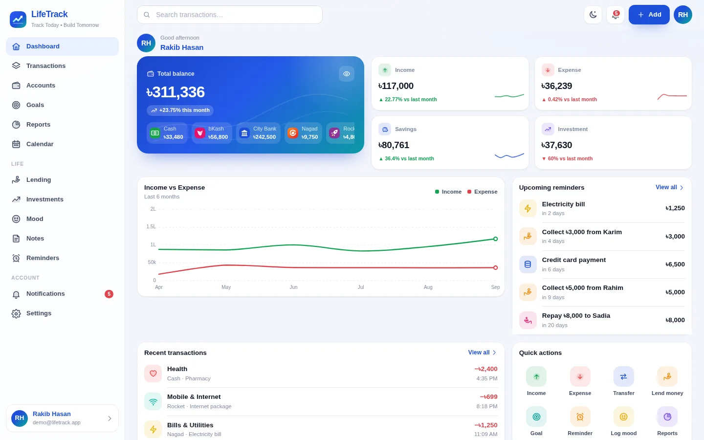

# LifeTrack — Track Today • Build Tomorrow

A premium personal **Life + Finance tracker** built as a real, installable PWA with **Node.js, Express and MySQL**.
Light mode is the default; a separately tuned Night mode is one tap away and syncs across devices.



## Quick start

```bash
cd lifetrack
npm install            # Node 18.17+ (22 LTS recommended)
npm start              # http://localhost:3000
```

Opening the site for the first time launches the **web installer** (`/install`):

1. **Database** — host, port, user, password, database name (created automatically if missing).
2. **Site & Super Admin** — site name/URL, default language, currency and timezone, admin account.
3. **Email (optional)** — SMTP for verification, password reset, reminders and security alerts.

The installer runs all migrations, generates an `APP_KEY` and Web Push (VAPID) keys, writes `config/config.json`
(mode 600, git-ignored) and then disables itself. Set `INSTALL_TOKEN` on public servers so nobody else can claim the install.

Optional demo data: `BASE_URL=http://localhost:3000 node scripts/seed-demo.js` (creates `demo@lifetrack.app` / `Demo12345`).

## Features

| Area | What's included |
| --- | --- |
| Money | Income, expense, investment, deposit, transfer, lending, borrowing, repayments, balance adjustments; categories, tags, notes, receipt attachments (image/PDF) |
| Accounts | Cash, Bank, bKash, Nagad, Rocket, Card, custom wallets; multi-currency with admin-managed rates; history, archive, reconcile |
| Lending | Person, amount, dates, contact, account; automatic reminders (*"You lent ৳5,000 to Rahim. Return date: 15 October."*) by in-app, email and push; partial payments, overpayment protection |
| Goals | Phone, bike, emergency fund, travel, education… with photo, progress rings, remaining amount and days |
| Reports | Daily / weekly / monthly / yearly: income vs expense, categories, savings, investment, profit/loss, net worth |
| Life | Calendar (money, dues, reminders, goals, moods), mood tracker, notes, reminders with repeat |
| Notifications | In-app, email (SMTP) and push (Web Push VAPID + Firebase Cloud Messaging); welcome, loan, bill, goal, security alerts, announcements |
| Auth & security | Email/password (Argon2id), email verification, Google OAuth, passkeys (WebAuthn), 2FA (authenticator, email codes, hashed recovery codes), secure password reset, device/session management, CSRF, Helmet/CSP, rate limits, lockouts, audit & security logs |
| Admin | Separate console: analytics, users (search/filter/pagination/detail, RBAC actions), transactions, categories, announcements & push, email logs/templates, translations, branding (logo, favicon, PWA icon, OG image — site name stays separate), SEO, landing, auth, SMTP, Firebase, backups, logs |
| PWA | Manifest with icons + maskable icons, screenshots and shortcuts; service worker (app shell cache, offline page, push); install prompt; PWABuilder-ready |
| i18n | English, বাংলা, हिन्दी — UI, errors, notifications and emails; admin can override any string |

## Architecture

```
lifetrack/
├─ server.js                 Express app (Helmet/CSP, compression, CSRF, sessions, routing)
├─ src/
│  ├─ migrations/*.sql       Versioned MySQL schema (FKs + indexes)
│  ├─ services/ledger.js     The only code that changes balances (DB transactions, row locks, idempotency)
│  ├─ services/…             auth, notify, mailer, push, reminders/scheduler, settings, i18n, uploads
│  ├─ routes/api/…           REST API (user)       routes/admin/api.js  REST API (admin, RBAC)
│  └─ routes/install.js      First-run installer
├─ public/                   SPA (vanilla ES modules, lazy-loaded views), CSS, icons, i18n, service worker
├─ views/                    Server-rendered shells (SEO landing, app, admin, installer)
└─ test/api.test.js          End-to-end API tests
```

**Financial safety.** Every balance change goes through `ledger.js` inside a MySQL transaction with `SELECT … FOR UPDATE`
on the affected accounts (locked in id order). Amounts are validated as exact decimals (max 2 places) and stored as `DECIMAL(15,2)`.
Clients send an `Idempotency-Key`; the `(user_id, idempotency_key)` unique index guarantees a retried or double-tapped
request can never create a duplicate. Offline transactions are shown as **“pending sync”** and only count once the server confirms.

**Authorization.** The user id always comes from the server-side session; every query is scoped by `user_id`, so changing
an id in a request returns 404. Admin routes check granular permissions (`super_admin`, `admin`, `support`) and write audit logs.

## Configuration

Everything is configurable in **Admin → Settings**; secrets (SMTP password, Google secret, Firebase service account,
VAPID private key) are AES-256-GCM encrypted at rest and never sent to the browser. See `.env.example` for env overrides.

- **Google login:** create an OAuth client, add redirect URI `https://YOUR_DOMAIN/api/auth/google/callback`, paste ID/secret, enable.
- **Passkeys:** require HTTPS (or `localhost`) and a correct *Site URL*.
- **Firebase (optional):** paste the web config JSON, Web Push certificate key and service-account JSON. Standard Web Push works without Firebase.
- **Production:** run behind HTTPS (Nginx/Caddy), set `NODE_ENV=production` and `TRUST_PROXY=1`, and use a process manager (pm2/systemd).

## Tests

```bash
BASE_URL=http://localhost:3000 ADMIN_EMAIL=you@example.com ADMIN_PASSWORD=… npm test
```

Covers CSRF, registration, exact balance math, invalid amounts, idempotency, concurrent writes, transfers, edit/delete reversal,
cross-user access (IDOR), lending with reminders and overpayment protection, goals, insights, TOTP + recovery-code login and admin RBAC.

## PWABuilder

Deploy on HTTPS, then enter your URL at pwabuilder.com. The manifest (`/manifest.webmanifest`) includes `id`, icons (72–512),
maskable icons, screenshots (narrow + wide), shortcuts, categories and `display_override`; the service worker is at `/sw.js`.
